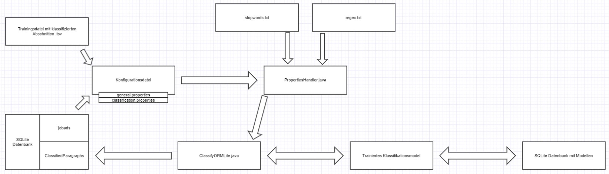
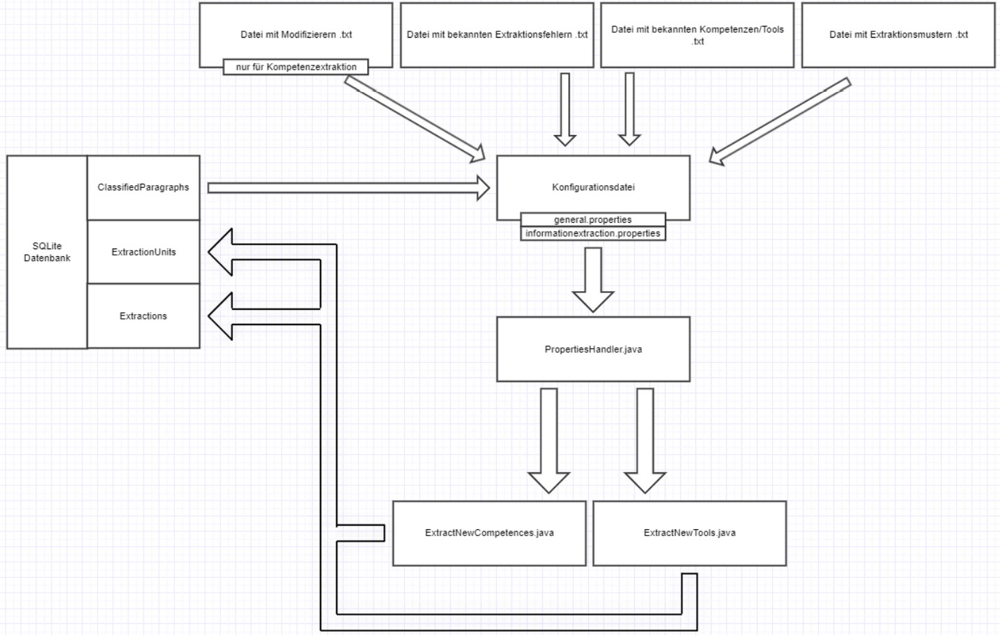
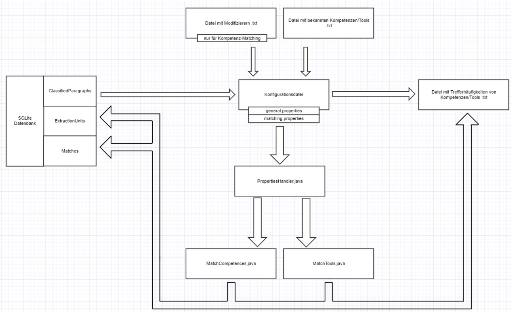

# quenfo
Main code of the BIBB project

## Dokumentation

**Schäfer, Christine (2021)**. *Evaluation von Extraktionsmustern im Kontext von Text Mining auf Stellenanzeigen*. Bachelorarbeit.   

**Geduldig, Alena (2017)**. *Muster und Musterbildungsverfahren für domänenspezifische
Informationsextraktion Ein Bootstrapping-Ansatz zur Extraktion von Kompetenzen aus Stellenanzeigen*. Masterarbeit. URL: <a href="http://www.spinfo.phil-fak.uni-koeln.de/sites/spinfo/arbeiten/Masterthesis_Alena.pdf">http://www.spinfo.phil-fak.uni-koeln.de/sites/spinfo/arbeiten/Masterthesis_Alena.pdf</a>    

**Geduldig, Alena & Betül Günturk-Kuhl (erscheint 2018)**. *Kompetenzanforderungen in Stellenanzeigen. Die Nutzung maschineller Lernverfahren zur Extraktion und Kategorisierung von Kompetenzen*.   

**Hermes, Jürgen & Manuel Schandock (2016)**. "Stellenanzeigenanalyse in der
Qualifikationsentwicklungsforschung. Die Nutzung maschineller Lernverfahren in der Klassifikation von Textabschnitten". In: *Fachbeiträge im Internet. Bundesinstitut für Berufsbildung*. URL: <a href="https://www.bibb.de/veroeffentlichungen/de/publication/show/8146">https://www.bibb.de/veroeffentlichungen/de/publication/show/8146</a>

## Dokumentation quenfo v1.1.4 Workflow Applikationen
(Stand: Juni 2021)
Das Framework quenfo bietet unterschiedliche Funktionen zur Verarbeitung von Stellenanzeigen an, die durch eine Implementierung in Java umgesetzt wurden. Diese unterteilen sich in die Klassifikation von Stellenanzeigen, in die Informationsextraktion von Kompetenzen und Tools und in Matching-Workflows zum Auffinden bereits bekannter Entitäten innerhalb klassifizierter Paragrafen.

In dieser Dokumentation werden die jeweiligen Workflows beschrieben. Dabei werden die einzelnen Schritte und die genutzten Klassen und Methoden aufgeführt. Jede ausführbare Applikation arbeitet mit Object Relational Mapping (ORM). Java-Objekte werden hierbei als Datenbankeinträge persistiert, d.h. in den Datenklassen (z.B. in den Klassen ExtractedEntity, InformationEntity oder ExtractionUnit) werden entsprechende Annotationen an Klassenattributen vorgenommen, um diese als vorzunehmenden Eintrag zu kennzeichnen. Für die Realisierung wurde ORMLite (https://ormlite.com) genutzt. 

Außerdem wird die Java-Bibliothek Lombok (https://projectlombok.org) genutzt. Mit dieser ist es möglich, grundlegende Methoden wie Getter und Setter für Klassenattribute nicht mehr auszuschreiben, da diese durch entsprechende Annotationen automatisch generiert und genutzt werden können.

### Klassifikation der Stellenanzeigen

Bei der Klassifikation werden die Stellenanzeigen in einzelne Paragrafen zerlegt, inhaltlich ausgewertet und einer Klasse zugeordnet. Folgende Klassen sind möglich: Informationen zum Unternehmen (Klasse 1), Beschreibung der Tätigkeit (Klasse 2), Anforderungen an die Bewerber:innen (Klasse 3), Formalia und Sonstiges (Klasse 4). Die Klassifikation dient der Eingrenzung der relevanten Paragrafen, die die für die Informationsextraktion gesuchten Informationen enthalten.

#### Notwendige Ressourcen
- SQLite-Datenbank mit Stellenanzeigen (jobad) mit folgenden Spalten: id, postingID, jahrgang, language, content
- txt-Datei mit Stopwords (stopword.txt)
- txt-Datei mit regulären Ausdrücken (regex.txt)
- Trainingsdatei mit klassifizierten Abschnitten (trainingdata_anonymized.tsv)

Alle Daten sind innerhalb von Konfigurationsdateien hinterlegt. Diese sind für die Klassifikation:

- general.properties
- classification.properties

Sollten andere Daten (mit anderen Namen) verwendet werden, können diese in den  jeweiligen Konfigurationsdateien angepasst werden. Für eine genauere Beschreibung der  Konfigurationsdateien kann die Dokumentation quenfo v.1.1.4 Konfiguration herangezogen werden.

#### Verwendete Java-Klassen
- ClassifyORMLite: Innerhalb dieser Klasse befindet sich die “Haupt-”Ausführung der Klassifikation. Sie enthält die Main-Methode, innerhalb derer alle für die Klassifikation notwendigen Methoden aufgerufen werden. Außerdem werden hier alle Konfigurationsparameter gesetzt (z.B. der Pfad zur Datenbank mit Stellenanzeigen und möglichen trainierten Modellen, die Anzahl der zu klassifizierenden Stellenanzeigen, der Pfad zu den Trainingsdaten etc.). Alle Konfigurationsparameter können in den o.g. Konfigurationsdateien eingesehen und verändert werden.

- Logger: Interface, das grundlegende Log-Vorgänge beschreibt. Wird durch andere Klassen ausgeführt.

- LogManager: Klasse wird dafür verwendet, einen Logger basierend auf dem Namen der ausführenden Klasse zu erhalten.

- DBMode: Zeigt an, ob die vorhandene Output-Datenbank überschrieben oder ergänzt werden soll. Der Wert wird bei Aufruf der Klassifikation übergeben (s. Dokumentation Konfiguration).

- PropertiesHandler: Stellt alle notwendigen Getter- und Setter-Methoden und weitere grundlegende Methoden für mögliche Konfigurationsparameter zur Verfügung und initialisiert die dazugehörigen Variablen mit den übergebenen Werten. In dieser Klasse wird nicht der Inhalt der jeweiligen Dateien initialisiert, sondern die Pfade zu den Dateien in Variablen gesetzt.

- ConnectionSource:
https://ormlite.com/javadoc/ormlitecore/com/j256/ormlite/support/ConnectionSource.html

- JdbcConnectionSource:
https://ormlite.com/javadoc/ormlitejdbc/com/j256/ormlite/jdbc/JdbcConnectionSource.html

- TableUtils:
https://ormlite.com/javadoc/ormlite-core/com/j256/ormlite/table/TableUtils.html

- FeatureUnitConfiguration: Initialisiert die Variablen für die Verarbeitung der Feature Units (FU = Tokens, Stems, NGramme usw. von ClassifyUnits). Gibt hierbei z.B. an, ob Stopwords entfernt oder Wörter normalisiert werden sollen. Stellt zudem alle notwendigen Getter- und Setter-Methoden und weitere grundlegende Methoden (z.B. toString(), hashCode(), etc.) zur Verfügung.

- AbstractFeatureQuantifier: Abstrakte Klasse mit grundlegenden Funktionen zur FeatureGewichtung. Wird durch verschiedene Quantifier-Klassen erweitert.

- LogLikeLiHoodFeatureQuantifier: Erweitert den AbstractFeatureQuantifier und erbt  somit die Merkmale der Klassen (alle Methoden und Variablen können verwendet werden). Bietet Methode zur Berechnung der Log LikeLiHood-Werte für die Feature Units an, für die dann jeweils Feature-Werte gesetzt werden.

- AbstractClassifier: Abstrakte Klasse für mögliche Klassifizierer. Enthält grundlegende Funktionen.

- ZoneKNNClassifier: Erweitert den ZoneAbstractClassifier, der wiederum den AbstractClassifier erweitert. So erbt der ZoneKNNClassifier jeweils die Merkmale beider Klassen. Ermöglicht die Klassifikation nach dem KNN-Algorithmus und bietet Methoden zur Modellbildung und Klassifikation an.

- RegexClassifier: Erweitert den ZoneAbstractClassifier, der wiedrum den AbstractClassifier erweitert. So erbt der RegexClassifier jeweils die Merkmale beider Klassen. Ermöglicht  die Klassifikation mithilfe von Regulären Ausdrücken und bietet Methoden zur Modellbildung und Klassifikation an.

- ExperimentConfiguration: Bündelt alle vorgenommen Konfigurationsparameter (FeatureUnitConfiguration, LogLikeLiHoodQuantifier, ZoneKNNClassifier, Trainingsdaten) in einer Klasse. Die in der Klasse vorhandenen Variablen werden mit übergebenen Parametern initialisiert. Außerdem sind grundlegenden Methoden wie Getter und Setter verfügbar.

- ORMDatabaseClassifier: Enthält relevante Methoden zum Trainieren eines  Klassifikationsmodells und zur Klassifikation der Stellenanzeigen. Die übergebenen  Parameter (Verbindung zur Datenbank mit Stellenanzeigen, Konfigurationsparameter, Trainingsdaten) initialisieren die in der Klasse vorhandenen Variablen.

- Dao: Interface, das beschreibt, wie das Schreiben und Lesen einer Klasse aus einer Datenbank realisiert wird (über Serialisierung). Stellt verschiedene Methoden zur Verfügung, die individuell implementiert werden können.

- DaoManager:
https://ormlite.com/javadoc/ormlite-core/com/j256/ormlite/dao/DaoManager.html

- Model: Abstrakte Klasse für Trainingsmodelle. Enthält grundlegende Funktionen. Wird  durch verschiedene Model-Klassen erweitert, z.B. ZoneKNNModel.

- ZoneJobs: Enthält alle relevanten Methoden, die für die Klassifikation und das Trainieren  des Klassifikationsmodells notwendig sind.

- SingleToMultiClassConverter: Verfügbare Klassen-IDs werden innerhalb dieser Klasse in  ihre Einzel-IDs zerlegt. Z.B. gibt es die Klassen 1-4, die jeweils eine SingleClass sind, und  die Klassen 5 und 6, die zwei Klassen zusammenfassen. Diese werden genutzt, wenn innerhalb eines Paragrafens inhaltlich mehr als eine Klasse vertreten ist.

- TrainingdataGenerator: Klasse zur Annotation der Trainingsdaten. Hierbei werden alle verfügbaren Informationen aus den Trainingsdaten in die dafür vorgesehenen Objekte transferiert.

- BufferedReader:
https://docs.oracle.com/javase/7/docs/api/java/io/BufferedReader.html

- StringBuffer: https://docs.oracle.com/javase/7/docs/api/java/lang/StringBuffer.html
- ClassifyUnit: Beinhaltet grundlegende Informationen zu klassifizierten Paragrafen, z.B. ID, JobAdID, Inhalt des Paragrafen. Bietet notwendige Methoden zur Verwendung der Variablen an, wie Getter und Setter.

- JASCClassifyUnit: Beinhaltet zusätzliche Informationen zu klassifizierten Paragrafen (Klassen-IDs). Erweitert die Klasse ClassifyUnits (dienen als Basis zur Generierung der Datenbank-Tabelle ClassifyUnit).

- EncodingProblemTreatment: Hilfsklasse zur Normalisierung von Paragrafen bzw. Strings,  falls ein Encoding notwendig ist.

- FeatureUnitTokenizer: Klasse zur Tokenisierung beliebiger Strings, die als FeatureUnit der klassifizierten Paragrafen verwendet werden.

- Normalizer: Bietet Methoden zur Normalisierung von Strings an.

- StopwordFilter: Bietet Methoden zur Filterung von Stoppwörtern an. Zur Initialisierung  der Stoppwörter werden die in der Konfigurationsdatei angegebene txt-Datei verwendet.

- Stemmer: Ersetzt Tokens durch ihre Stems. Verwendet hierfür den Snowball-Stemmer für deutsche Wörter.

- SnowballProgram: http://snowball.tartarus.org

- LetterNGrammGenerator: Klasse zur Generierung von NGrammen anhand übergebener  Kontextgrößen über die Konfigurationsdatei.

- ClassifyUnitFilter: Klasse zur Filterung der ClassifyUnits nach bestimmten Kriterien, z.B.  Anzahl der Token, FeatureUnits oder Characters.

- Multiset:
https://guava.dev/releases/18.0/api/docs/com/google/common/collect/Multiset.html

- LogLikeLiHood:
https://mahout.apache.org/docs/0.13.0/api/docs/mahoutmath/org/apache/mahout/math/stats/LogLikelihood.html

- QueryBuilder:
https://ormlite.com/javadoc/ormlite-core/com/j256/ormlite/stmt/QueryBuilder.html

- PreparedQuery:
https://ormlite.com/javadoc/ormlitecore/com/j256/ormlite/stmt/PreparedQuery.html

- JobAd: Klasse zur Auszeichnung der Parameter einer Stellenanzeige. Beinhaltet  grundlegende Informationen für die entsprechenden Variablen, z.B. Getter und Setter. Klasse wird in der Datenbank mittels Dao persistiert (Datenbank-Tabelle JobAds).

- ClassifyUnitSplitter: Enthält Methoden zur Verarbeitung der ClassifyUnits, die diese nach unterschiedlichen Kriterien unterteilen, verarbeiten, zusammenfügen.

- DistanceCalculator: Berechnet für verschiedene Distanzmaße die Distanz zwischen zwei Vektoren.

#### Verwendete Methoden
- getLogger() : LogManager: Ermöglicht die Verwendung eines Loggers im Namen der ausführenden Klasse.

- loadProperties(): ClassifyORMLite: Übergabe des Pfads zur Konfigurationsdatei als Parameter. Überprüft, ob der Pfad existiert (bei Nicht-Existenz wird Anwendung abgebrochen). Mithilfe der Methoden aus der Klasse PropertiesHandler werden die in der Konfigurationsdatei angegebenen Parameter in die entsprechenden Variablen initialisiert.

 	➢ initialize(): PropertiesHandler: Übergabe des Pfads zum Ordner config als Parameter. Darauf basierend werden alle Pfade zu möglichen Konfigurationsdateien sowie anderen relevanten Dateien wie die Liste mit Stopwords oder das Tagger-Model in die dafür vorgesehenen Variablen initialisiert.

 	➢ getStringProperty(): PropertiesHandler: Bekommt zwei Buzzwords als Parameter übergeben und übergibt diese wiederum der Methode getProperty().

 	➢ getIntProperty(): PropertiesHandler: Bekommt zwei Buzzwords als Parameter übergeben und übergibt diese wiederum der Methode getProperty(). Der Rückgabewert wird wiederum in einen Integer umgewandelt (Integer.parseInt()).

 	➢ getBoolProperty(): PropertiesHandler: Bekommt zwei Buzzwords als Parameter übergeben und übergibt diese wiederum der Methode getProperty(). Der Rückgabewert wird wiederum in einen Boolean umgewandelt (Boolean.parseBoolean()).

 	➢ getIntArrayProperty(): PropertiesHandler: Bekommt zwei Buzzwords als Parameter übergeben. Diese werden in einem ersten Schritt der Methode getProperty() übergeben und es wird überprüft, ob der Rückgabewert leer ist. Wenn das nicht der Fall ist, wird der Inhalt in Fragmente zerlegt (Strings werden nach Kommata getrennt mit split()) und in Integer umgewandelt. Dabei werden leere Fragmente herausgefiltert (replaceAll()).

 	➢ getProperty(): PropertiesHandler: Nutzt Buzzwords zur Identifizierung der übergebenen Konfigurationsdatei (Parameter 1) und zur Filterung des Variablenwerts von Parameter 2.
Bsp: getProperty(“general”, “orm_database”)
➔ general: es wird die Konfigurationsdatei general.properties gesucht
➔ orm_database: Name der gesuchten Variabel innerhalb der Datei
➔ Rückgabewert: String mit Wert der Variable

- getModelDao(): AbstractClassifier: Bekommt die Verbindung zur models.db-Datenbank als Parameter übergeben, stellt eine Verbindung zur models-db her und sucht ein persistentes Modell für die entsprechende Klasse.
	➔ Die Methode wird in der entsprechenden Klassifizierer-Klasse implementiert, z.B. in der Klasse ZoneKNNClassifier.

	➢ createDao(): DaoManager: Überprüft, ob für angegebene Klasse bereits ein Dao-Objekt existiert und wenn dem nicht so, wird für die Klasse eins erstellt.

- getPersistedModels(): AbstractClassifier: Übergabe des Hashcodes von bereits persistenten Modellen als Parameter. Der HashCode wird aus der ExperimentConfiguration abgeleitet und setzt sich aus den HashCodes der FeatureUnitConfiguration, des verwendeten Quantifizierers und Klassifizierers sowie der verwendeten Trainingsdaten zusammen (hashCode(): ExperimentConfiguration).

	➔ Die Methode wird in der entsprechenden Klassifizierer-Klasse implementiert, z.B. in der Klasse ZoneKNNClassifier. Dabei wird überprüft, ob in der Datenbank models.db bereits ein Eintrag mit dem angegebenen HashCode vorhanden ist. Über die Klasse Dao kann eine Anfrage an die Datenbank gestellt werden.

- getFQ(): Model: Gibt eine Instanz des genutzten FeatureQuantifier zurück.

- train(): ORMDatabaseClassifier: Die Methode wird nur aufgerufen, falls noch kein Modell mit der angegebenen ExperimentConfiguration in der model.db-Datenbank vorhanden ist. Bekommt als Parameter die ExperimentConfiguration und einen Platzhalter für ein persistierendes Modell übergeben. Trainiert anhand der übergebenen Parameter ein Klassifikationsmodell und gibt dieses zurück. Nutzt hierfür hauptsächlich Methoden aus der Klasse ZoneJobs.

	➔ Bei der Instanziierung des ZoneJobs-Objekts wird ein SingleToMultiClassConverter-Objekt übergeben, dessen Wert innerhalb der Klasse ZoneJobs einer Variabel zugewiesen wird. Das Objekt zeichnet alle verfügbaren Klassen-IDs aus (translations = Multiclass der IDs).

	➢ getCategorizedParagraphsFromFile(): ZoneJobs: Bekommt als Parameter die Trainingsdaten und einen Boolean, der angibt, ob eine Normalisierung vorgenommen werden soll oder nicht, übergeben. Als Rückgabewert ist eine Liste mit klassifizierten Paragrafen (ClassifyUnits) vorgesehen.
	 - ❖ getTrainingData(): TrainingDataGenerator: Gibt eine Liste mit trainierten  ClassifyUnits zurück. Liest die Datei mit Trainingsdaten aus (mithilfe der Klassen BufferedReader und StringBuffer). Trennt die Strings nach einfachem Tabstopp (\t), speichert diese in einem String-Array und überprüft daraufhin dessen Länge. Wenn das Array die Länge 2 oder 3 hat, wird überprüft, ob bereits eine Klassen-ID vorhanden ist (tritt erst nach Beenden des ersten Durchlaufs ein). Wenn dem so ist, wird ein neues JASCClassifyUnit-Objekt erstellt und (bei einer Länge von 3) die ausgelesenen Inhalte (content, jahrgang, postingID, classID) aus der Trainingsdatei übergeben. Die neuen Objekte werden der Liste mit den ClassifyUnits hinzugefügt. Wenn wiederum keine Klassen-ID angegeben ist, werden die Variablen jahrgang, postingID und classID mit entsprechend gefilterten Inhalt gefüllt. Falls das Array nicht eine der beiden Länge hat, wird die Datei nach Zeilenumbruch (\n) getrennt. Somit kann der content ausgelesen und in die entsprechende Variable gefüllt werden.

	 - ❖ normalizeEncoding(): EncodingProblemTreatment: Überprüft übergebenen String-Parameter auf mögliche Kodierungs-Probleme, überprüft hierbei jeden einzelnen Character, und gibt überarbeiteten String zurück. Wird nur aufgerufen, wenn übergebener Parameter der Methode getCategorizedParagraphsFromFile() true gesetzt ist.

- ➢ initializeClassifyUnits(): ZoneJobs: Bekommt eine Liste von ClassifyUnits als Parameter übergeben. Für jeden klassifizierten Paragrafen wird eine Liste mit Tokens erstellt. Diese wird dem jeweiligen ClassifyUnit-Objekt als FeatureUnit übergeben.
	 - ❖ tokenize(): FeatureUnitTokenizer: Übergabe eines Strings, der anhand vorgegebener Delimiters in Tokens zerlegt wird (hier: ClassifyUnit.getContent()).
	 - ❖ setFeatureUnits(): ClassifyUnit: Setzt übergebene Liste mit Tokens als FeatureUnit für den jeweiligen Paragrafen.
- ➢ setFeatures(): ZoneJobs: Wendet die FeatureUnitConfiguration auf die ClassifyUnits der Trainingsdaten an und gibt die Liste mit ClassifyUnits verarbeitet zurück. Es wird überprüft, welche Konfiguration vorgenommen werden soll: Normalisieren, Stopwords filtern, Stemmen, NGrams, SuffixTree, MiScore. Die Anwendung ist hierbei optional und wird in den entsprechenden Konfigurationsdateien festgelegt.
	 - ❖ normalize(): Normalizer: Bekommt eine Liste von Strings (FeatureUnits) als Parameter übergeben. Falls bei der Instanziierung des Normalizer-Objekts keine Parameter übergeben werden, werden Nummern normalisiert und alle Strings kleingeschrieben.
	 - ❖ filterStopwords(): StopwordFilter: Bekommt eine Liste von Strings übergeben, aus der Stopwörter entfernt werden.
	 - ❖ getStems(): Stemmer: nutzt die Methode stem() des Snowball-Stemmers, um die als Parameter übergebene Liste mit Strings auf ihre Stems zu reduzieren. Siehe auch: http://snowball.tartarus.org/algorithms/german/stemmer.html
	 - ❖ getNGramms(): LetterNGrammGenerator: Bekommt als Parameter die FeatureUnits einer ClassifyUnit, eine Kontextgröße wie auch einen Boolean, ob die NGramme über Wortgrenzen hinweg gebildet werden sollen. Sowohl Kontextgröße als auch Boolean wird innerhalb der Konfigurationsdatei angegeben. Gebildete NGramme werden als Liste von Strings zurückgegeben.
	 - ❖ filterByFUs(): ClassifyUnitFilter: Filter übergebene ClassifyUnits nach der Anzahl der FeatureUnits. Die Mindestanzahl wird als Methode übergeben.
- ➢ setFeatureVectors(): ZoneJobs: Initialisiert die Feature-Vektoren einer ClassifyUnit anhand der übergebenen Parameter (Quantifizierer, FeatureUnitOrder), wenn ein Quantifizierer angegeben wurde. Wenn keiner angegeben ist, werden die ClassifyUnits unbearbeitet zurückgegeben.
	 - ❖ setFeatureValues(): AbstractFeatureQuantifier: Methode wird von der Klasse des verwendeten Quantifizierers implementiert, hier: LogLikeLiHoodFeatureQuantifier). Berechnet Feature-Values mit übergebenen Quantifizier und setzt entsprechende Feature-Vektoren für die ClassifyUnit.
		 - ● getFeatureUnitOrder(): AbstractFeatureQuantifier: Methode wird genutzt, um die FeatureUnitOrder (= Reihenfolge der Wörter) zu setzen, falls diese noch nicht gesetzt wurde. Dabei werden Dopplungen der FeatureUnits einer ClassifyUnit entfernt, sodass FeatureUnits nur noch einmalig vorkommen.
		 - ● initialize(): LogLikeLiHoodFeatureQuantifier: Initialisiert die FeatureUnits einer ClassifyUnit als BagOfWord und speichert diese in ein Multiset mit allen möglichen BoWs. Wird nur aufgerufen, wenn keine FeatureUnitOrder übergeben wurde.
		 - ● create(): Multiset: Erstellt anhand der übergebenen BoW einer ClassifyUnit (nicht zwingend als Parameter zu übergeben) ein Multiset.
		 - ● compareFrequencies(): LogLikeLiHood: Vergleicht zwei Sets von BagOfWords, um zu überprüfen, welche Elemente im ersten Satz überrepräsentiert sind (Schwellenwert ist 0.0, da hier nur Gewichtung vorgenommen werden soll und keine Feature-Reduktion). Vergleicht hier Multiset der FeatureUnits einer ClassifyUnit mit der Multiset ohne doppelte FeatureUnits einer ClassifyUnit (beide wurden im vorherigen Schritt erstellt).
		 - ● setFeatureVector(): ClassifyUnit: Ermittelter Vektor wird zu der dazugehörigen ClassifyUnit gesetzt. Reihenfolge kann hierbei durch die FeatureUnitOrder eingehalten werden. Die Werte der Vektoren liegen nicht nur zwischen 0 und 1.

- ➢ getNewModelForClassifier(): ZoneJobs: Erstellt aus übergebener Liste der ClassifyUnits (hier: Trainingsdaten) und der ExperimentCofniguration ein neues Modell, indem die Informationen der ExperimentConfiguration genutzt werden und ein neuer HashCode erstellt wird.

- ➢ create(): Dao: Erstellt ein Dao(-Model)-Objekt zur Speicherung in der Datenbank.

- classify(): ORMDatabaseClassifier: Hauptanwendung zur Klassifikation. Klassifiziert mit hilfe des trainierten Modells und der ExperimentConfiguration die übergebenen Stellenanzeigen. Nutzt hierfür sowohl einen Regex-Klassifizierer als den, der in der ExperimentConfiguration angegeben ist (hier: ZoneKNNClassifier). Klassifikation läuft so lange wie querylimit angesetzt ist. Es werden verschiedene DB-Anfragen erstellt, um die Daten zu nutzen. Stellenanzeigen, die bereits klassifiziert werden, werden hierbei nicht berücksichtigt, mithilfe der IDs der SteAs aus der ClassifyUnit-Tabelle können diese aus dem Ablauf entfernt werden.

- ➢ getRegex(): PropertiesHandler: Reguläre Ausdrücke werden bei der Initialisierung des PropertiesHandler aus der in der Konfigurationsdatei angegebenen txt-Datei extrahiert und mit dieser Methode verwendbar gemacht.

- ➢ queryBuilder(): Dao: Instanziiert ein neues QueryBuilder-Objekt für das JobAd- und  ClassifyUnit-Dao-Objekt.

- ➢ countOf(): QueryBuilder: Zählt die Anzahl der Zeilen innerhalb einer DB-Tabelle (hier: die der JobAd-Tabelle). Wird nur eingesetzt, wenn in der Konfigurationsdatei querylimit < 0 ist (-1 = alle Stellenanzeigen sollen verarbeitet werden).

- ➢ removeAll(): List: Entfernt aus einer Liste alle als Parameter übergebenen Inhalte. Wird hier eingesetzt, um die Liste der zu klassifizierenden Stellenanzeigen um die zu verkleinern, die bereits klassifiziert wurden.

- ➢ classifyJobAd(): ORMDatabaseClassifier: Methode zur Klassifikation der Stellenanzeigen. Diese werden sowohl über einen Regex-Klassifikators als auch den über die ExperimentConfiguration übergebenen Klassifikator klassifiziert. Die Stellenanzeigen werden zuerst in Paragrafen zerlegt. Paragrafen werden dann als potenzielle ClassifyUnits abgespeichert und vorverarbeitet (Initialisierung, Setzen der FeatureUnits und Feature-Vektoren). Daraufhin werden sie zuerst durch den Regex-Klassifizierer verarbeitet und als nächstes durch den übergebenen. Die Ergebnisse beider werden zusammengeführt und als klassifizierte Paragrafen zurückgegeben.

	 ❖ splitIntoParagraphs(): ClassifyUnitSplitter: Bekommt als Parameter einen String übergeben, der den Inhalt der Stellenanzeige enthält. Dieser wird an Leerzeichen unterteilt, dann werden alphanumerische Zeichen entfernt und Listenelemente und Zeilen, die nicht mit einem Punkt enden und mit einem Großbuchstaben beginnen, zusammengeführt. Stellenbezeichnungen werden ausgelassen.

	 -  ● splitAtEmptyLines(): ClassifyUnitSplitter: Zerlegt übergebenen String zuerst an Leerzeichen (splitAtNewLine(): ClassifyUnitSplitter) und speichert Einzelteile des Strings in einer Liste. Die enthaltenen Strings werden daraufhin überprüft, ob sie leer sind oder nicht. Wenn nicht, werden sie mit einem Leerzeichen versehen. Die Liste wird zurückgegeben.
	 -  ● mergeList(): ClassifyUnitSplitter: Überprüft die Zusammengehörigkeit der Strings in der übergebenen Liste und fügt diese dann zusammen. Nutzt hierfür einen regulären Ausdruck (isListItem(): ClassifyUnitSplitter).

	 -  ● containsOnlyNonWordCharacters(): ClassifyUnitSplitter: Überprüft den String auf alphanumerische Zeichen und gibt einen Boolean zurück.
	 -  ● mergeWhatBelongsTogether(): ClassifyUnitSplitter: Überprüft übergebene String-Liste, ob die enthaltenen Strings bestimmte Kriterien erfüllen: beginnen mit einem Großbuchstaben (startsWithUpperCase(): ClassifyUnitSplitter), enden mit einem Punkt (endsWithDot(): ClassifyUnitSplitter) oder sehen aus wie eine Stellenbezeichnung (looksLikeJobTitle(): ClassifyUnitSplitter). Anhand dieser Kriterien werden dann Strings entweder zusammengefügt oder nicht.

 ❖ normalizeEncoding(): EncodingProblemTreatment: s.o.

 ❖ initialiazieClassifyUnits(): ZoneJobs: s.o.

 ❖ setFeatures(): ZoneJobs: s.o.

 ❖ setFeatureVectores(): ZoneJobs: s.o.

 ❖ classify(): RegexClassifier: Überprüft den Inhalt der ClassifyUnits, ob er einen regulären Ausdruck enthält. Die Gesamtanzahl der Treffer der Regexes wird in einer lokalen Variabel gesichert. Zurückgegeben wird ein Boolean-Array mit jeweiligen Klassenzugehörigkeiten.

❖ classify(): ZoneJobs: Klassifiziert die Paragrafen nach übergebenen Klassifizierer. Hier noch keine Implementation des Klassifikationsworkflows, da dieser spezifisch für den verwendeten Klassifizierer ist. Hier genutzt: ZoneKNNClassifier. Zurückgegeben wird eine Map mit ClassifyUnits (= key) und zugehörigen Klassen-IDs in einem Boolen-Array (= value).
	 - ● classify(): ZoneKNNClassifier: Nutzt knn zur Klassifizierung der Paragrafen. Hierbei wird die Distanz zwischen dem Feature-Vektor der ClassifyUnit und dem der Trainingsdateien gemessen. 
	 - ● getDistance(): DistanceCalculator: Berechnet die Distanz zweier Feature-Vektoren über das übergebene Distanzmaß (hier: Cosinus. getCosinusDistance(): DistanceCalculator). 

 ❖ mergeResults(): ZoneJobs: Fügt zwei ClassifyUnit-Maps mit ihren Klassen-IDs zusammen. Dabei wird der Wert einer Klassen-ID auf true gesetzt, wenn dieser innerhalb einer der beiden Maps für eine ClassifyUnit true ist.
 
❖ translateClasses(): ZoneJobs: Die Klassen-IDs einer ClassifyUnit werden aufgesplittet, d.h. vor Einsatz der Methoden können ClassifyUnits nur eine Klassen-ID haben (dabei ist die Klasse 5 oder 6 eine Kombination aus beiden Klassen). Nach Einsatz der Methode sind Multiclasses sichtbar durch mehrere true-Werte im Boolean-Array der ClassifyUnit.

#### Sonstige Hinweise
Die Klasse **AbstractFeatureQuantifier** und **AbstractClassifier** werden durch verschiedene Klassen erweitert und ermöglichen so eine unterschiedliche Feature-Gewichtung und Klassifikation. Bei der Initialisierung dieser in den Main-Methoden der einzelnen Anwendungen können die verwendeten Klassen durch andere ausgetauscht werden.

Für den AbstractFeatureQuantifier wären diese:

- AbsolutFrequencyFeatureQuantifier
- **LogLikeLiHoodFeatureQuantifier**
- RelativeFrequencyFeatureQuantifier
- TFIDFFeatureQuantifier.

Für den AbstractClassifier wären diese:
- **RegexClassifier**
- **ZoneKNNClassifier**
- ZoneNaiveBayesClassifier
- ZoneRocchioClassifier.

### Informationsextraktion

Die Informationsextraktion dient zur Extraktion von in den Stellenanzeigen aufgeführten interessanten Informationen. Dazu zählen u.a. die Kompetenzen, die von den Bewerber:innen gefordert werden, und Tools und Arbeitsmittel zur Durchführung des Jobs. Für die Informationsextraktion werden die im vorherigen Schritt klassifizierten Paragrafen genutzt, da die gesuchten Informationen auf einzelnen Klassen eingegrenzt werden können. Somit muss nicht die gesamte Stellenanzeige betrachtet werden, der Ablauf wird auf relevante Paragrafen begrenzt.

#### Notwendige Ressourcen
- SQLite-Datenbank mit Tabelle ClassifiedParagraphs (diese wird beim Durchlaufen der Klassifikation erstellt). Folgende Spalten werden benötigt: classIDs, ClassONE, ClassTWO, ClassTHREE, ClassFOUR, id, jobad_id, TEXT.
- SQLite-Datenbank für Extractions und ExtractionUnits werden innerhalb der Applikation erstellt.
- txt-Datei mit Modifizierern (modifier.txt) für die Kompetenzextraktion
- txt-Datei mit bekannten Extraktionsfehlern (noCompetences.txt/noTools.txt)
- txt-Datei mit bekannten Kompetenzen/Tools (competences.txt/tools.txt)
- txt-Datei mit Extraktionsmuster (competenceContexts.txt/toolContexts.txt)
- txt-Datei mit möglichen String-Verbindungen (possibleCompounds.txt)
- txt-Datei mit möglichen String-Trennungen (splittedCompounds.txt)
- Lemmatizer-Modell (lemma-ger-3.6.model)
- Tagger-Modell (tag-ger-3.6.model)
- Modell zur Zerlegung von Texten in Sätze (de-sent.bin)
- Tokenizer-Modell (de-token.bin)

Alle Daten sind innerhalb von Konfigurationsdateien hinterlegt. Diese sind für die 
Informationsextraktion:
- general.properties
- informationextraction.properties
Sollten andere Daten (mit anderen Namen) verwendet werden, können diese in den jeweiligen Konfigurationsdateien angepasst werden. Für eine genauere Beschreibung der Konfigurationsdateien kann die Dokumentation quenfo v.1.1.4 Konfiguration herangezogen werden.

#### Verwendete Java-Klassen
- *ExtractNewCompetences*: Innerhalb dieser Klasse befindet sich die “Haupt-Ausführung der Informationsextraktion von Kompetenzen. Sie enthält die Main-Methode, innerhalb derer alle für die Informationsextraktion notwendigen Methoden aufgerufen werden. Außerdem werden hier alle Konfigurationsparameter gesetzt (z.B. der Pfad zur Datenbank mit klassifizierten Paragrafen, die Anzahl der zu bearbeitenden Paragrafen etc.). Alle Konfigurationsparameter können in den o.g. Konfigurationsdateien eingesehen und verändert werden.
- *ExtractNewTools*: Innerhalb dieser Klasse befindet sich die “Haupt-”Ausführung der Informationsextraktion von Tools. Sie enthält die Main-Methode, innerhalb derer alle für die Informationsextraktion notwendigen Methoden aufgerufen werden. Außerdem werden hier alle Konfigurationsparameter gesetzt (z.B. der Pfad zur Datenbank mit klassifizierten Paragrafen, die Anzahl der zu bearbeitenden Paragrafen etc.). Alle Konfigurationsparameter können in den o.g. Konfigurationsdateien eingesehen und verändert werden.
- *PropertiesHandler*: s.o.
- *DBMode*: s.o.
- *ConnectionSource*: s.o.
- *JdbcConnectionSource*: s.o.
- *TableUtils*: s.o.
- *ORMExtractor*: Klasse mit Hauptmethoden zur Extraktion von Entitäten. Bei Initialisierung werden folgende Parameter übergeben: Verbindung zur SQLite-Datenbank, Dateien mit bekannten Kompetenzen/Tools, Extraktionsfehlern, Modifizierern und Extraktionsmustern, IEType (entweder Kompetenzen oder Tools) und ob koordinierte Ausdrücke (z.B. “be- und entladen”) extrahiert werden sollen. Verbindet hierfür hauptsächlich Methoden der Klasse IEJobs.
- IEJobs: Enthält alle Methoden zur Extraktion und zum Matching von Tools bzw. Kompetenzen. Bei der Initialisierung werden Files mit bekannten Entitäten, Extraktionsfehlern, Modifizieren und Extraktionsmustern übergeben und in die entsprechenden Variablen eingelesen.
- Tool: https://docs.oracle.com/javase/7/docs/api/javax/tools/Tool.html
- Dao: s.o.
- DaoManager: s.o.
- JASCClassifyUnit: s.o.
- ExtractionUnit: Eine ExtractionUnit ist ein Teil eines klassifizierten Paragrafen (ClassifyUnit). Es handelt sich hierbei meist um einen einzelnen Satz, der mit lexikalischen Informationen angereichert wird, z.B. Lemmata, PoS-Tags. Diese werden für die Informationsextraktion benötigt. Die Klasse dient außerdem der Generierung der Datenbank-Tabelle ExtractionUnits. Bietet grundlegende Funktionen wie Getter und Setter an.
- InformationEntity: Repräsentiert eine extrahierte Entität und wird durch einen Ausdruck von einem oder mehreren Lemmata definiert. Bietet grundlegende Funktionen wie Getter und Setter an.
- ExtractedEntity: Erweitert die Klasse InformationEntity und repräsentiert eine extrahierte Entität (Kompetenz oder Tool). Diese Klasse wird zur Generierung der Datenbank-Tabelle Extractions genutzt.
- Pattern: Klasse zur Repräsentation eines Extraktionsmusters, das aus einer Reihe von Tokens besteht und einem Zeiger, welcher Token die gesuchte Entität darstellt. Die verwendete Musterstruktur kann sowohl aus den verwendeten Mustern abgeleitet werden oder ist in der Präsentation “20201001_Patternbeschreibung_JB.pptx” beschrieben.
- RatePatternExtraction: Klasse zur Evaluation der Extraktionsmuster und den gefundenen Extraktionen. Weist diesen einen Confidence-Wert (Güte) zu, auf dessen Basis eine Selektion durchgeführt wird.
- Where:
https://ormlite.com/javadoc/ormlite-core/com/j256/ormlite/stmt/Where.html
- QueryBuilder: s.o.
- PreparedQuery: s.o.
- ExtractionUnitBuilder: Klasse zur Zerlegung der klassifizierten Paragrafen in einzelne Sätze.
- IETokenizer: Tokenizer-Klasse, der NLP-Modelle nutzt und somit Texte in Sätze und Sätze in Tokens zerlegen kann. Nutzt hierfür die in den Ressourcen hinterlegten Modelle.
- SentenceDetectorME: Durch MEM werden Satzgrenzen erkannt und Text in Sätze zerlegt.
https://opennlp.apache.org/docs/1.7.1/apidocs/opennlp-tools/opennlp/tools/sentdetect/SentenceDetectorME.html
- MateTagger: Annotiert ExtractionUnits mit lexikalischen Informationen. Nutzt hierfür Mate-Tools.
https://code.google.com/archive/p/mate-tools/wikis/ParserAndModels.wiki
- ClassifyUnitSplitter: s.o.
- Util: Enthält Methoden zur Datenverarbeitung, z.B. zum Normalisieren von Strings, zum Auslesen von csv-Dateien etc.
- CoordinateExpander: https://github.com/johannabi/CoordinateExpander

#### Verwendete Methoden

- loadProperties(): ExtractNewCompetences/ExtractNewTools: s.o. Diese Methode ist für jede ausführbare Anwendung implementiert und hat immer die gleiche Funktionalität. Es werden lediglich andere Parameter übergeben, die aus den verschiedenen Konfigurationsdateien genommen werden.
- getPossibleCompounds(): PropertiesHandler: Wird bei der Initialisierung des ORMExtractors aufgerufen und gibt mögliche String-Verbindungen zurück, die über den PropertiesHandler aus einer übergebenen Datei genommen wird.
- getSplittedCompounds(): PropertiesHandler: Wird bei der Initialisierung des ORMExtractors aufgerufen und gibt mögliche String-Trennungen zurück, die über den PropertiesHandler aus einer übergebenen Datei genommen wird.
- initialize(): ORMExtractor: Initialisiert Variablen der Klassen-IDs für die klassifizierten Paragrafen (categories = SingleClass, translations = MuliClass).
- extract(): ORMExtractor: Übergeordnete Methode zur Informationsextraktion. Unterteilt sich in verschiedene Aufgaben, die durch weitere externe Methoden ausgeführt werden. Extraktion läuft so lange wie querylimit angesetzt ist. Die entsprechende Anzahl an ClassifyUnits wird aus der Datenbank-Tabelle extrahiert. Dabei werden ClassifyUnits, die bereits vorverarbeitet wurden und dementsprechende ExtractionUnits zugeordnet werden können, nicht betrachtet. Neue ExtractionUnits werden entsprechend annotiert und für die musterbasierte Informationsextraktion genutzt.

	 ➢ getLemmatizerModel(): PropertiesHandler: Ermöglicht die Verwendung eines übergebenen Lemmatisierer-Modells, das als NLP-Komponente in den Ressourcen-Dateien hinterlegt ist.

	 ➢ getTaggerMode(): PropertiesHandler: Ermöglicht die Verwendung eines übergebenen Tagger-Modells, das als NLP-Komponente in den Ressourcen-Dateien hinterlegt ist.

	 ➢ createDao(): DaoManager: s.o.

	 ➢ initializeIEUnits(): ExtractionUnitBuilder: Zerlegt übergebene ClassifyUnits in einzelne Sätze (ExtractionUnits), überarbeitet diese und setzt lexikalische Informationen.

	- ❖ splitIntoSentences(): IETokenizer: Bekommt den Inhalt eines Paragrafen als Parameter übergeben und erkennt mittels SentenceDetector vorhandene Satzgrenzen. Sätze werden an diesen Stellen getrennt und in einer Liste zurückgegeben.
	 - ● sentDetect(): SentenceDetectorME: Sucht im übergebenen String nach Satzgrenzen und gibt einzelne Sätze zurück.
	 - ● splitListItems(): IETokenizer: Zerlegt übergebenen String zuerst an Leerzeichen (splitAtNewLine(): ClassifyUnitSplitter) und entfernt alle Non-Wörter (containsOnlyNonWordChars(): ClassifyUnitSplitter).
	- ❖ correctSentence(): ExtractionUnitBuilder: Überprüft übergebenen Satz mit verschiedenen Regexes und korrigiert ihn.
	- ❖ setLexicalData(): MateTagger: Annotiert übergebenen Satz mit Lemmata, PoS-Tags und Morph-Tags. Verwendet angegebenen Modelle.

 ➢ create(): Dao: s.o.

 ➢ annotateTokens(): IEJobs: Annotiert Tokens einer ExtractionUnit mit Informationen über bekannte Entitäten, Extraktionsfehler oder Modifizierer. Es werden jeweils die Lemmata betrachtet (normalizeLemma(): Utils).

	- ❖ annotateEntities(): IEJobs: Überprüft, ob Token der ExtractionUnit bereits in der Liste mit bekannten Entitäten vorkommt. Wenn dem so ist, wird zutreffender Token entsprechend annotiert.
	- ❖ annotateNegativeExamples(): IEJobs: Überprüft, ob Token der ExtractionUnit bereits in der Liste mit Extraktionsfehlern vorkommt. Wenn dem so ist, wird zutreffender Token entsprechend annotiert.
	- ❖ annotateModifiers(): IEJobs: Überprüft, ob Token der ExtractionUnit bereits in der Liste mit Modifizierern vorkommt. Wenn dem so ist, wird zutreffender Token entsprechend annotiert.

 ➢ extractEntities(): IEJobs: Bekommt als Parameter annotierte ExtractionUnits und Lemmatizer-Modell übergeben. Führt eine musterbasierte Suche durch. Die Muster werden über die Klasse Pattern zur Verfügung gestellt. Es werden nur die Muster genutzt, die entweder noch keinen Confidence-Wert zugeordnet bekommen haben oder die, die in einem vorherigen Durchlauf einen Wert über 0.5 erzielt haben. Vergleicht die Token eines Muster mit denen des Satz und überprüft Übereinstimmungen. Wenn ein Satz mit einem Muster übereinstimmt, gibt der ExtractionPointer die Stelle an, an der die Entität extrahiert werden soll. Morphemkoordinationen werden dabei berücksichtigt.

 ➢ getNewCompounds(): IEJobs: Falls keine möglichen String-Verbindungen oder String-Trennungen bei der Initialisierung übergeben wurden, wird eine leere Map zurückgegeben. Ansonsten werden bereits vorhandene Compounds-Varianten zurückgegeben.

 ➢ removeKnownEntities(): ORMExtractor: Entfernt bereits bekannte Entitäten aus der Liste mit neuen Extraktionen.

 ➢ evaluatePattern(): RatePatternExtraction: Evaluiert die innerhalb eines Extraktionsdurchlaufs genutzten Muster und berechnet einen entsprechenden Confidence-Wert. Dieser orientiert sich daran, wie viele Extraktionen durch ein Muster gefunden wurden, die bereits als valide Entität in der Liste bekannter Entitäten vorhanden ist. Je mehr bekannte Entitäten ein Muster findet, desto besser wird es bewertet.

 ➢ evaluateSeed(): RatePatternExtraction: Evaluiert die in einem Durchlauf gefundenen Extraktionen in Abhängigkeit der Confidence-Werte der Muster, die die jeweilige Extraktion gefunden hat. Je mehr Muster mit hohen Werten die Extraktionen gefunden haben, desto besser fällt die Bewertung dieser aus.

 ➢ selectBestEntities(): RatePatternExtraction: Betrachtet die ermittelten Confidence-Werte der Extraktionen und filtert die heraus, die einen bestimmten Wert erreichen konnten. Diese werden zurückgegeben und für die weitere Informationsextraktion genutzt.

### Matching

Das Matching dient zum Auffinden bereits bekannter Entitäten innerhalb der klassifizierten Paragrafen. Durch String-Matching werden diese in den Paragrafen gesucht.

#### Notwendige Ressourcen
- SQLite-Datenbank mit Tabelle ClassifiedParagraphs (diese wird beim Durchlaufen der Klassifikation erstellt). Folgende Spalten werden benötigt: classIDs, ClassONE, ClassTWO, ClassTHREE, ClassFOUR, id, jobad_id, TEXT.
- txt-Datei mit Modifizieren (modifiers.txt)
- txt-Datei mit bekannten Entitäten (Kompetenzen/Tools)
- Lemmatizer-Modell (lemma-ger-3.6.model)

Alle Daten sind innerhalb von Konfigurationsdateien hinterlegt. Diese sind für das Matching:
- general.properties
- matching.properties

Sollten andere Daten (mit anderen Namen) verwendet werden, können diese in den jeweiligen Konfigurationsdateien angepasst werden. Für eine genauere Beschreibung der 
onfigurationsdateien kann die Dokumentation quenfo v.1.1.4 Konfiguration herangezogen werden.

#### Verwendete Java-Klassen
- MatchTools: Innerhalb dieser Klasse befindet sich die “Haupt-”Ausführung des Matching von Tools. Sie enthält die Main-Methode, innerhalb derer alle für das Matching notwendigen Methoden aufgerufen werden. Außerdem werden hier alle Konfigurationsparameter gesetzt (z.B. der Pfad zur Datenbank mit klassifizierten Paragrafen, die Anzahl der zu bearbeitenden Paragrafen etc.). Alle Konfigurationsparameter können in den o.g. Konfigurationsdateien eingesehen und verändert werden.
- MatchCompetences: Innerhalb dieser Klasse befindet sich die “Haupt-”Ausführung des Matching von Kompetenzen. Sie enthält die Main-Methode, innerhalb derer alle für das Matching notwendigen Methoden aufgerufen werden. Außerdem werden hier alle Konfigurationsparameter gesetzt (z.B. der Pfad zur Datenbank mit klassifizierten Paragrafen, die Anzahl der zu bearbeitenden Paragrafen etc.). Alle Konfigurationsparameter können in den o.g. Konfigurationsdateien eingesehen und verändert werden.
- DBMode: s.o.
- ConnectionSource: s.o.
- JdbcConnectionSource: s.o.
- TableUtils: s.o. 
- ExtractionUnit: s.o.
- InformationEntity: s.o.
- MatchedEntity: Erweitert die Klasse InformationEntity und repräsentiert eine via String-Matching extrahierte Entität (Kompetenz oder Tool). Diese Klasse wird zur Generierung der Datenbank-Tabelle Matches genutzt.
- ORMExtractor: s.o.
- Tool: s.o.
- Dao: s.o.
- DaoManager: s.o.
- QueryBuilder: s.o.
- PreparedQuery: s.o.
- JASCClassifyUnit: s.o.
- Pattern: s.o.
- Where: s.o.
- Utils: s.o.

#### Verwendete Methoden
- loadProperties(): MatchTools/MatchCompetences: s.o. Diese Methode ist für jede ausführbare Anwendung implementiert und hat immer die gleiche Funktionalität. Es werden lediglich andere Parameter übergeben, die aus den verschiedenen Konfigurationsdateien genommen werden.

- stringmatch(): ORMExtractor: Bekommt als Parameter die Startposition, die Anzahl der zu verarbeitenden Paragrafen und die Anzahl der parallelen Verarbeitung übergeben. Anhand dieser wird ein String-Matching durchgeführt, das bekannte Entitäten innerhalb der klassifizierten Paragrafen sucht. Verwendet dafür werden hauptsächlich Methoden der IEJobs. Das Matching läuft so lange wie das querylimit gesetzt ist. Die entsprechende Anzahl an ClassifyUnits wird aus der Datenbank-Tabelle extrahiert. ExtractionUnits werden entsprechend aus den ClassifyUnits extrahier, annotiert und für das weitere Matching genutzt.

	 ➢ getLemmatizerModel(): PropertiesHandler: s.o.
	 ➢ createDao(): DaoManager: s.o.
	 ➢ initalizeIEUnits(): ExtractionUnitBuilder: s.o.
	 ➢ create(): Dao: s.o.
	 ➢ annotateTokens(): IEJobs: s.o.
	 ➢ matchBatch(): ORMExtractor: Hauptanwendung des String-Matchings. Bekommt als Parameter die ExtractionUnits sowie das Lemmatizer-Modell übergeben und führt das Matching mit externen Methoden durch.

	- ❖ extractByStringMatch(): IEJobs: Token der ExtractionUnits werden normalisiert verarbeitet (normalizeLemma(): Utils). Diese werden mit bereits bekannten Entitäten verglichen. Wenn Token überstimmen, werden sie zurückgegeben.
	- ❖ mergeInformationEntities(): IEJobs: Überprüft extrahierte Entitäten auf gemeinsames Vorkommen. Wenn zwei Entitäten zusammen vorkommen, werden diese zusammengefasst.
	- ❖ setModifiers(): IEJobs: Wird nur beim Kompetenz-Matching ausgeführt. Die Modifizierer der ExtraktionUnits werden entsprechend annotiert.